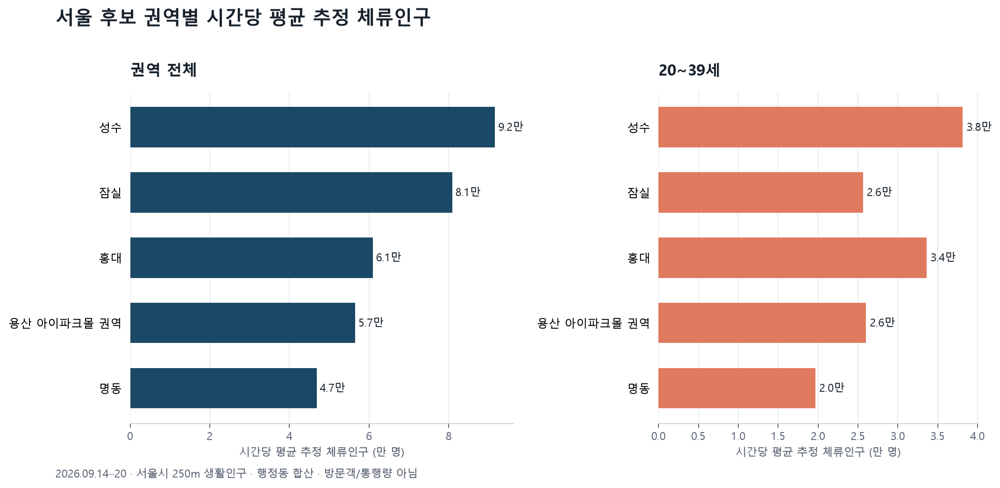
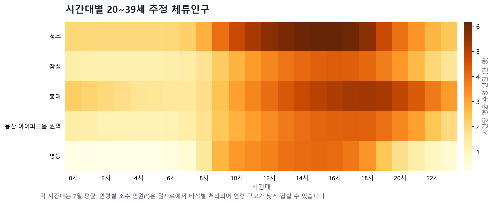

# 서울 야외 팝업 후보·일정 1차 리포트

**작성 기준일:** 2026년 9월 30일  
**권고 일정:** 2026년 10월 10일(토) 13:00–18:00  
**우선 검토 권역:** 성수

## 추천

현재 확보한 자료를 기준으로는 **10월 10일 토요일, 성수 권역에서 13~18시에 운영**하는 안을 먼저 검토합니다. 성수 행정동 범위에서 전체 추정 체류인구와 20~39세 추정 인원이 가장 컸고, 시간대별로는 전체 인원이 15시, 20~39세 인원이 16시에 가장 높았습니다. 13~18시 운영은 두 지표의 높은 시간대를 포함합니다.

이 일정은 공개 인구 자료로 세운 **기획용 추천**입니다. 아직 행사 주소·브랜드·공간 조건과 행사 당일 예보가 없으므로 실제 팝업 방문객 1만 명을 보장하거나 예측한 결과는 아닙니다. 일정은 10월 10일로 잡되, 야외 진행 가능 여부는 행사 2~3일 전에 강수·강풍·대기질 예보로 최종 확인해야 합니다.

## 후보 권역 비교

분석 자료는 서울시 250m 격자 생활인구의 2026년 9월 14~20일 시간별 집계입니다. 각 권역에 포함한 행정동 전체 격자의 추정 인원을 합산한 뒤 7일·24시간 평균을 냈습니다.

| 권역 대리 범위 | 시간당 평균 전체 추정 인원 | 시간당 평균 20~39세 | 전체 평균 최고 시간 | 20~39세 평균 최고 시간 |
|---|---:|---:|---:|---:|
| 성수 | 91,642명 | 38,128명 | 15시 | 16시 |
| 잠실 | 80,880명 | 25,631명 | 15시 | 16시 |
| 홍대(서교동) | 60,963명 | 33,606명 | 17시 | 18시 |
| 용산 아이파크몰 권역(한강로동) | 56,533명 | 26,005명 | 15시 | 17시 |
| 명동 | 46,861명 | 19,663명 | 14시 | 15시 |

**해석:** 전체 규모와 20~39세의 추정 인원 절대값은 성수가 가장 큽니다. 홍대는 20~39세 비중이 약 55%로 다섯 후보 중 가장 높아, 타깃 비중을 특히 중시한다면 대안 후보입니다. 성수와 홍대의 순위 차이는 우선순위가 “타깃 인원 규모”인지 “타깃 비중”인지에 따라 달라질 수 있습니다.

## 일정·날씨 판단

- **날짜:** 2026년 10월 10일 토요일로 우선 고정했습니다. 야외 팝업의 주말 유입을 노리는 일정 선택이며, 아직 여러 주 자료를 이용한 요일별 예측 결과는 아닙니다.
- **시간:** 성수 기준 13~18시를 제안합니다. 관측 주의 15~16시가 전체·타깃 인원의 시간별 평균 최고 구간에 해당합니다.
- **날씨:** 9월 30일 현재 이 자료에는 10월 10일 시간대별 강수·바람·대기질 예보가 없습니다. 따라서 날씨 적합성을 통과했다고 볼 수 없습니다. 행사 전 최신 예보를 반영해 야외 진행 또는 실내 대안을 결정해야 합니다.

## 이 자료로 말할 수 있는 것과 없는 것

- 서울시 자료는 통신자료를 바탕으로 추정한 **해당 시간의 권역 내 체류인구**입니다. 통행량, 방문객 누계, 팝업 입장객 수와는 다른 지표입니다.
- 지역 단위는 확정된 행사 주소 반경이 아니라 행정동 대리 범위입니다. 실제 대관 장소를 정하면 주변 250m 격자와 운영 조건으로 다시 계산해야 합니다.
- 연령별 소수 인원은 원자료에서 `*`로 비식별 처리됩니다. 집계된 20~39세 수와 비율은 과소 추정될 수 있습니다.
- 이번에는 한 주의 요약만 분석했으므로 회귀·머신러닝 모델의 정확도, 예측 구간, 다음 주 인원을 산출하지 않았습니다. 10월 10일 표기는 날짜·시간 선택을 위한 1차 권고이지 ML 예측치가 아닙니다.
- “팝업에 만 명이 온다”를 예측하고 사후 검증하려면 행사별 시간대 입장객 카운터 기록이 필요합니다. 매출·구매 성과는 POS 자료로 별도 확인해야 합니다.

## 데이터와 재현

- 서울시, [250m 격자 생활인구(내국인)](https://data.seoul.go.kr/dataList/OA-22784/F/1/datasetView.do) — 시간·행정동·격자·성별·연령대별 추정치
- Sweetspot, [2026 상반기 팝업 트렌드](https://www.sweetspot.co.kr/leadmagnet_2026trend) — 팝업 지역 후보 선정 참고자료
- 수집·집계: `python collect_seoul_population_week.py`
- 시각화: `python make_report_visuals.py`
- 분석 집계표: `data/processed/seoul_presence_week_20260914_20260920.csv`
